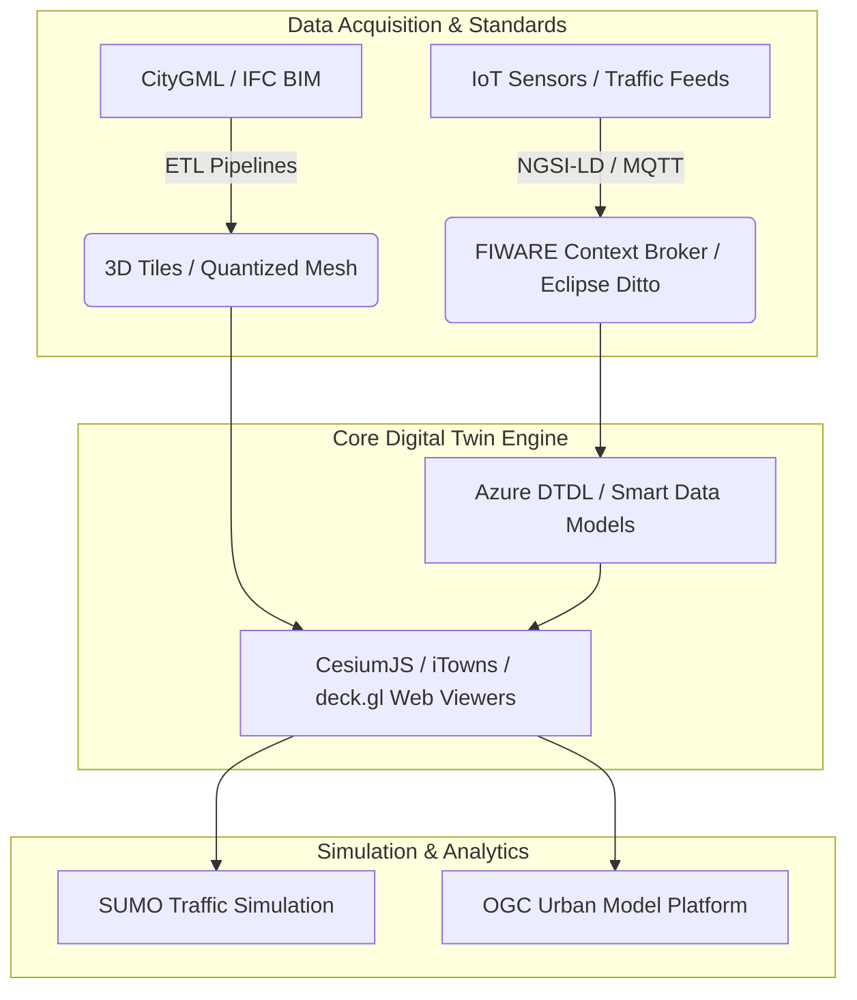

  
  
  
  
  

# 🏙️ Awesome Digital Twin For Smart Cities ⚡

A curated repository of top **SaaS platforms**, **open-source software**, **3D geospatial engines**, **sensor fusion frameworks**, and **urban simulation tools** for building **Smart City Digital Twins**.

Smart City Digital Twins create real-time, living virtual replicas of urban environments—spanning municipal infrastructure, building information modeling (BIM), geographic information systems (GIS), traffic flows, energy grids, and IoT sensor networks—enabling city planners, CIOs, and engineers to visualize, simulate, and optimize urban operations.

---

## 📑 Table of Contents
- [📊 Market Overview & Dynamics](#-market-overview--dynamics)
- [🏢 SaaS & Commercial Platforms](#-saas--commercial-platforms)
- [💻 Open-Source GitHub Projects](#-open-source-github-projects)
- [🏗️ Architectural Stacks & Frameworks](#️-architectural-stacks--frameworks)
- [🤝 How to Contribute](#-how-to-contribute)
- [💖 Support & Sponsorship](#-support--sponsorship)
- [📈 Star History](#-star-history)
- [⚠️ Disclaimer](#️-disclaimer)

---

## 📊 Market Overview & Dynamics

Estimated Smart Cities Digital Twin Market Size: **~$35.4 Billion by 2030** (growing at a CAGR of ~28.5%). The sector is currently **highly fragmented**, driven by bespoke municipal requirements, diverse IoT sensor protocols, localized spatial regulations, and heterogeneous data schemas rather than a single winner-take-all platform.

---

## 🏢 SaaS & Commercial Platforms

The table below lists leading commercial enterprise platforms for urban digital twins, ranked in **descending order by company size** (market capitalization / valuation & revenue):

| 🏢 Product / Company | 📝 Description | 📊 Company Size (Valuation / Rev) | 💵 Starting Price | 🎁 Free Tier / Free Trial Limits |
|---|---|---|---|---|
| **[Azure Digital Twins](https://azure.microsoft.com/en-us/products/digital-twins)**  *(Microsoft)* | Cloud spatial intelligence & IoT digital twin platform for modeling city-wide asset relationships. | **$3.12 Trillion** ($245B Revenue) | $0.004 per 1,000 operation messages | 12-Month Free Account with 5,000 ops/month free + $200 free trial credit |
| **[NVIDIA Omniverse](https://www.nvidia.com/en-us/omniverse/)**  *(NVIDIA)* | Real-time 3D simulation platform for photorealistic city twins & AI-driven urban scenarios. | **$3.01 Trillion** ($126B Revenue) | $4,500 / named user / year (Enterprise) | 30-Day Enterprise Trial & Free Workstation License for individual creators |
| **[Autodesk InfraWorks](https://www.autodesk.com/products/infraworks/overview)**  *(Autodesk)* | Civil infrastructure conceptual design & contextual 3D urban environment simulation. | **$56.8 Billion** ($5.8B Revenue) | $2,405 / user / year ($300 / month) | 30-Day Full Feature Free Trial |
| **[3DEXPERIENCE City](https://cityzenith.com/)**  *(Dassault Systèmes)* | City-scale virtual twin platform for sustainable urban planning, mobility, & municipal operations. | **$48.5 Billion** ($6.1B Revenue) | $2,700 / user / year ($225 / month) | 14-Day Cloud Sandbox Trial with 10GB storage limit |
| **[Bentley iTwin Platform](https://www.bentley.com/software/itwin-platform/)**  *(Bentley Systems)* | Infrastructure digital twin platform for reality mesh integration, BIM, & GIS data federations. | **$15.4 Billion** ($1.2B Revenue) | $1,500 / year developer base tier | Free Developer Tier with 1,000 API calls/month & 1GB iModel storage limit |
| **[ArcGIS Urban](https://www.esri.com/en-us/arcgis/products/arcgis-urban/overview)**  *(Esri)* | Web-based 3D urban planning software for zoning compliance, land use, and development scenarios. | **$10.0 Billion** ($1.7B Revenue) | $2,750 / user / year (Add-on license) | 21-Day ArcGIS Online & Urban Trial with 500 service credits |
| **[Unity Industry](https://unity.com/solutions/industry)**  *(Unity Software)* | Real-time 3D engine for enterprise digital twins, interactive city visualization, & spatial AR/VR. | **$8.2 Billion** ($2.1B Revenue) | $4,950 / seat / year | 30-Day Unity Industry Trial & Free Personal Plan for revenue < $200k/yr |
| **[Replica](https://www.replicahq.com/)**  *(Replica HQ)* | Data platform modeling nationwide mobility, traffic networks, and land-use economic impacts. | **$350 Million** ($25M Revenue) | $25,000 / year regional data access | 14-Day Guided Regional Data Demo with 1 sample metropolitan export |
| **[Cityzenith SmartWorldPro](https://cityzenith.com/)**  *(Cityzenith)* | 3D urban digital twin platform aggregating building energy, climate, and IoT sensor streams. | **$50 Million** ($5M Revenue) | $12,000 / seat / year ($1,000 / month) | 14-Day Interactive Sandbox Trial with pre-loaded city dataset limit |

---

## 💻 Open-Source GitHub Projects

Below are top open-source projects, components, and libraries for building custom, standards-compliant urban digital twins. Ranked by **GitHub Stars_Count (descending)**:

| 📦 Repository | ⭐ Stars_Count Badge | 📖 Description & Smart City Use Case |
|---|---|---|
| **[CesiumJS](https://github.com/CesiumGS/cesium)** |  | Leading open-source 3D geospatial platform for web globe rendering, 3D Tiles streaming, and city twin viewports. |
| **[deck.gl](https://github.com/visgl/deck.gl)** |  | WebGL2/WebGPU visualization layer for massive urban geospatial data, origin-destination flows, and real-time overlays. |
| **[Eclipse SUMO](https://github.com/eclipse-sumo/sumo)** |  | Microscopic traffic simulator for mobility analysis, public transit routing, and urban emission what-if modeling. |
| **[iTowns](https://github.com/iTowns/itowns)** |  | Three.js-based framework for visualizing 3D spatial data (3D Tiles, CityGML, point clouds) in web browsers. |
| **[Eclipse Ditto](https://github.com/eclipse-ditto/ditto)** |  | Open digital twin framework managing state synchronization & API abstractions for smart city IoT devices. |
| **[3DCityDB](https://github.com/3dcitydb/3dcitydb)** |  | Spatial database schema & tooling (Oracle/PostGIS) for storing, managing, and exporting CityGML 3D city models. |
| **[FIWARE Orion Context Broker](https://github.com/telefonicaid/fiware-orion)** |  | Core smart city context manager implementing NGSI-LD specs for live sensor data & city state synchronization. |
| **[FIWARE Smart Data Models](https://github.com/smart-data-models/data-models)** |  | Open standardized JSON-LD data models for smart cities, environmental sensors, traffic, energy, and water. |
| **[citygml4j](https://github.com/citygml4j/citygml4j)** |  | Java API for parsing, processing, validating, and transforming CityGML datasets in 3D urban model pipelines. |
| **[Digital Twin Toolbox](https://github.com/geosolutions-it/digital-twin-toolbox)** |  | Automated ETL workflow generating 3D Tiles from Shapefiles, LiDAR, and BIM data for Cesium-based viewers. |
| **[Azure DTDL Smart Cities](https://github.com/Azure/opendigitaltwins-smartcities)** |  | Open Digital Twins Definition Language (DTDL) models for smart city domain assets mapped to NGSI-LD standards. |
| **[Urban Model Platform](https://github.com/Urban-Model-Platform/urban-model-platform)** |  | OGC API Processes implementation to orchestrate and execute urban simulation models within digital twins. |
| **[Digital Twin City Viewer (DTCC)](https://github.com/paramountric/digitaltwincityviewer)** |  | Web-based viewer for collaborative right-time urban visualization developed by Chalmers University (DTCC). |

---

## 🏗️ Architectural Stacks & Frameworks

### Reference Open Stack:
- **3D Geospatial Visualization**: `CesiumJS` + `3D Tiles` + `deck.gl`
- **Context Broker & IoT Messaging**: `FIWARE Orion (NGSI-LD)` + `Eclipse Ditto`
- **Semantic City Databases**: `CityGML` + `3DCityDB` + `citygml4j`
- **Traffic & Mobility Simulation**: `Eclipse SUMO` + `Urban Model Platform`

---

## 🤝 How to Contribute

Contributions are welcome! Help us maintain the most comprehensive, up-to-date reference for Smart City Digital Twins:

1. 🍴 **Fork** this repository.
2. 📝 **Add/edit** entries in `README.md` keeping formatting consistent.
3. 📌 Ensure entries include official links, descriptions, pricing/star metrics, and correct categories.
4. 🚀 Submit a **Pull Request** with a clear explanation of changes.

---

## 💖 Support & Sponsorship

Thank you for visiting and supporting **Awesome Digital Twin For Smart Cities**! 🙏

If you found this repository helpful, please consider showing your support:
- ⭐️ **Star** this repository to help others discover it!
- 🍴 **Fork** it to contribute or customize your own collection.
- 📢 **Share** it with fellow urban planners, geospatial engineers, and smart city architects.
- ☕ **Sponsor / Buy me a coffee**: If you'd like to support ongoing updates and maintenance, consider sponsoring via the [GitHub Sponsor Dashboard](https://github.com/sponsors/ishandutta2007) or clicking below:

  

---

## 📈 Star History

---

## ⚠️ Disclaimer

- This is a community-curated collection intended for educational, architectural reference, and research purposes.
- Urban digital twin platforms process sensitive geospatial, infrastructure, and mobility data. Always adhere to local privacy regulations (GDPR, CCPA), cybersecurity standards, and open-data governance frameworks.

---

Made with ❤️ for City CIOs, Urban Planners, GIS Engineers & Smart-City Architects.

